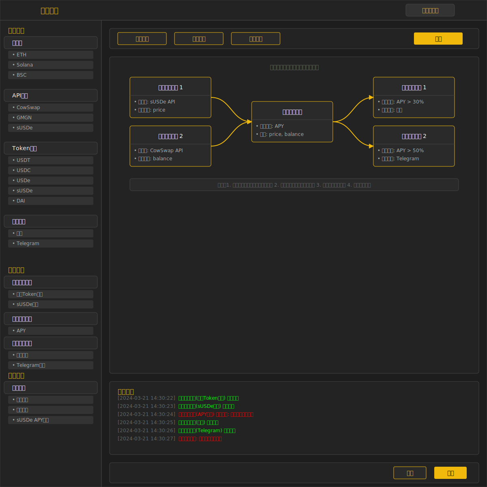

# 多链套利系统新功能原型说明

## 1. HTTP请求配置界面改进


### 1.1 界面优化要点

1. **请求方法选择器**
   - 添加下拉菜单选择HTTP方法（GET/POST/PUT/DELETE）
   - 根据所选方法动态显示或隐藏请求体配置

2. **变量检测与替换**
   - 自动扫描URL、请求头和请求体中的变量模板（`{{variable}}`）
   - 生成变量输入表单，支持默认值设置
   - 变量值实时预览功能

3. **请求头编辑器**
   - 提供常用请求头预设（Content-Type、Authorization等）
   - 支持键值对形式添加自定义请求头
   - 自动检测并建议适合的Content-Type

4. **API类型切换**
   - 增加HTTP/CHAIN类型切换开关
   - 根据选择显示不同的配置表单

## 2. 数据采集配置界面改进



### 2.1 字段映射区域优化

1. **JSON路径辅助工具**
   - 提供路径语法提示和自动补全
   - 实时验证路径是否有效
   - 支持路径可视化选择器

2. **测试结果展示优化**
   - 分区域显示请求日志、响应数据和提取结果
   - 支持JSON格式美化和折叠/展开
   - 添加复制按钮方便调试

3. **字段自动发现**
   - 分析API响应数据，自动推荐有价值的字段
   - 一键添加推荐字段到映射列表
   - 智能识别数值型和字符串型字段

## 3. 无代理网络请求流程图

```
+-------------------+     +------------------+     +------------------+
| 用户配置API请求   | --> | 系统检测环境     | --> | 直接使用fetch   |
+-------------------+     +------------------+     +------------------+
                                  |                          |
                                  | 失败                     | 成功
                                  v                          v
                          +------------------+     +------------------+
                          | 使用GM_xmlhttp  |     | 处理响应数据     |
                          +------------------+     +------------------+
                                  |                          |
                                  | 失败                     v
                                  v                  +------------------+
                          +------------------+       | 提取字段映射数据 |
                          | 使用代理服务     |------>+------------------+
                          +------------------+                |
                                                            v
                                                    +------------------+
                                                    | 返回处理结果     |
                                                    +------------------+
```

## 4. 字段提取功能示例

### 4.1 基础路径提取
```
响应数据: {"price": 1800.50, "volume": 1250000}
路径: price
提取结果: 1800.50
```

### 4.2 嵌套对象提取
```
响应数据: {"data": {"market": {"price": 1800.50}}}
路径: data.market.price
提取结果: 1800.50
```

### 4.3 数组索引提取
```
响应数据: {"data": {"markets": [{"symbol": "ETH", "price": 1800.50}]}}
路径: data.markets[0].price
提取结果: 1800.50
```

## 5. UI/UX改进要点

1. **渐进式表单填写**
   - 按逻辑顺序分步骤填写表单
   - 每一步验证通过后才能进入下一步
   - 提供明确的完成指示和进度展示

2. **实时反馈机制**
   - 在用户操作过程中提供即时反馈
   - 错误提示直接显示在相关字段旁边
   - 成功操作有视觉和文字确认

3. **分组与折叠设计**
   - 将复杂表单分组并支持折叠/展开
   - 减少初始视觉复杂度
   - 保留高级选项的可访问性

4. **上下文帮助**
   - 在关键配置项旁添加帮助图标
   - 悬停显示详细说明和示例
   - 提供常见问题解答链接

## 6. 字段映射表格优化

| 从API中提取的字段 (JSON路径) | 映射到系统的字段名 | 字段说明 | 数据类型 | 操作 |
|-------------------------------|-------------------|----------|----------|------|
| price | ethPrice | ETH价格 | 数字 | 编辑/删除 |
| volume | ethVolume | 24小时交易量 | 数字 | 编辑/删除 |
| data.timestamp | updateTime | 更新时间 | 日期时间 | 编辑/删除 |
| + 添加新字段 |  |  |  |  |

## 7. 后续UI优化计划

1. **深色模式优化**
   - 确保所有组件在深色主题下有良好对比度
   - 优化颜色方案，减少眼睛疲劳

2. **响应式设计完善**
   - 优化移动设备上的表单布局
   - 确保关键功能在小屏幕上可用

3. **键盘导航增强**
   - 改进表单的Tab键导航逻辑
   - 添加键盘快捷键支持常用操作

4. **性能优化**
   - 使用虚拟滚动处理大型数据表格
   - 优化组件渲染性能
   - 添加数据加载状态指示器 