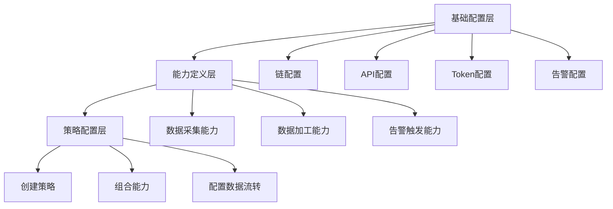

# 业务流程图

```mermaid
graph TD
    A[基础配置层] --> B[能力定义层]
    B --> C[策略配置层]
    
    %% 基础配置层详情
    A --> A1[链配置]
    A --> A2[API配置]
    A --> A3[Token配置]
    A --> A4[告警配置]
    
    %% 能力定义层详情
    B --> B1[数据采集能力]
    B --> B2[数据加工能力]
    B --> B3[告警触发能力]
    
    %% 策略配置层详情
    C --> C1[创建策略]
    C --> C2[组合能力]
    C --> C3[配置数据流转]
``` 